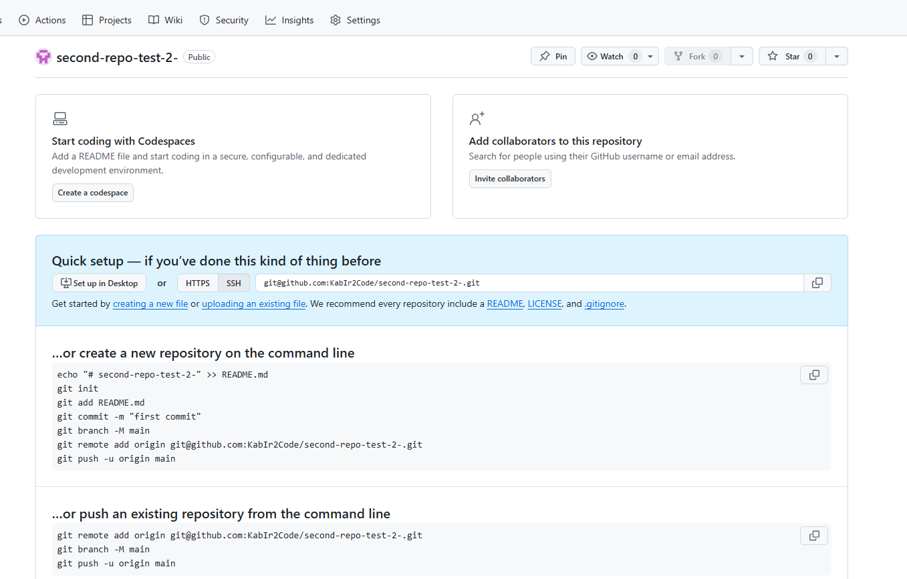
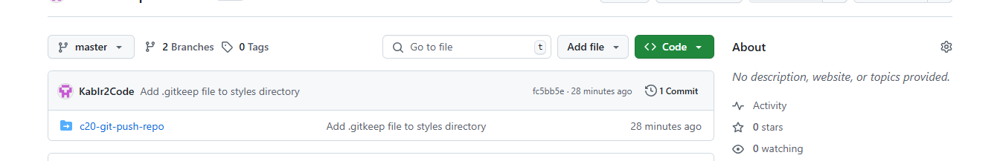

<!-- Making a git repository -->
<!-- Here im making the repository -->
PS C:\The_Jump_Kabir_Hussain\Javascript\assests> mkdir my-git-ex
<!-- 2. Open another vscode window in an empty folder (In a safe directory: `mkdir my-git-ex && cd my-git-ex && code .`) -->

    Directory: C:\The_Jump_Kabir_Hussain\Javascript\assests

Mode                 LastWriteTime         Length Name
----                 -------------         ------ ----
d-----        01/06/2025     15:59                my-git-ex

PS C:\The_Jump_Kabir_Hussain\Javascript\assests> cd my-git-ex
PS C:\The_Jump_Kabir_Hussain\Javascript\assests\my-git-ex> code
PS C:\The_Jump_Kabir_Hussain\Javascript\assests\my-git-ex> git status

fatal: not a git repository (or any of the parent directories): .git
<!-- 3. Do `git status` on your terminal (with the pointer in this directory). You should get 'Fatal: Not a git repository' -->

PS C:\The_Jump_Kabir_Hussain\Javascript\assests\my-git-ex> code
PS C:\The_Jump_Kabir_Hussain\Javascript\assests\my-git-ex> 

Admin@DESKTOP-M416I15 MINGW64 ~ (master)
$ gt staus
bash: gt: command not found

% 5. Now do `git status` again (normally you'd stop here and move on, but for demo...)

Admin@DESKTOP-M416I15 MINGW64 ~ (master)
$ git status
warning: could not open directory 'Application Data/': Permission denied
warning: could not open directory 'Cookies/': Permission denied
warning: could not open directory 'Documents/My Music/': Permission denied   
warning: could not open directory 'Documents/My Pictures/': Permission denied
warning: could not open directory 'Documents/My Videos/': Permission denied  
warning: could not open directory 'Local Settings/': Permission denied       
warning: could not open directory 'My Documents/': Permission denied
warning: could not open directory 'NetHood/': Permission denied
warning: could not open directory 'PrintHood/': Permission denied
warning: could not open directory 'Recent/': Permission denied
warning: could not open directory 'SendTo/': Permission denied
warning: could not open directory 'Start Menu/': Permission denied
warning: could not open directory 'Templates/': Permission denied
On branch master

No commits yet

Untracked files:
  (use "git add <file>..." to include in what will be committed)
        .android/
        .bash_history
        .bash_profile
        .codeium/
        .console-ninja/
        .gitconfig
        .lesshst
        .node_repl_history
        .quokka/
        .redhat/
        .ssh/
        .viminfo
        .vscode/
        3D Objects/
        AppData/
        Contacts/
        Downloads/
        Favorites/
        IntelGraphicsProfiles/
        Links/
        MicrosoftEdgeBackups/
        Music/
        NTUSER.DAT
        NTUSER.DAT{53b39e88-18c4-11ea-a811-000d3aa4692b}.TM.blf
        NTUSER.DAT{53b39e88-18c4-11ea-a811-000d3aa4692b}.TMContainer00000000000000000001.regtrans-ms
        NTUSER.DAT{53b39e88-18c4-11ea-a811-000d3aa4692b}.TMContainer00000000000000000002.regtrans-ms
        OneDrive - London South Bank University/
        OneDrive/
        Pictures/
        Saved Games/
        Searches/
        Videos/
        c20-git-push-repo/
        first-react-app/
        ntuser.dat.LOG1
        ntuser.dat.LOG2
        ntuser.ini

nothing added to commit but untracked files present (use "git add" to track)
<!-- 6. Delete the `.git` folder (`rm -rf .git`) -->
Admin@DESKTOP-M416I15 MINGW64 ~ (master)
$ rm -rf .git
Admin@DESKTOP-M416I15 MINGW64 ~
$ git status
fatal: not a git repository (or any of the parent directories): .git

<!-- Adding files -->

<!-- 1. Create a file called `index.html` and add some HTML inside it. -->
Admin@DESKTOP-M416I15 MINGW64 ~
$ touch index.html

Admin@DESKTOP-M416I15 MINGW64 ~

$ git status
fatal: not a git repository (or any of the parent directories): .git

Admin@DESKTOP-M416I15 MINGW64 ~
$ git init
Initialized empty Git repository in C:/Users/Admin/.git/

Admin@DESKTOP-M416I15 MINGW64 ~ (master)
$ git status
warning: could not open directory 'Application Data/': Permission denied
warning: could not open directory 'Cookies/': Permission denied
warning: could not open directory 'Documents/My Music/': Permission denied
warning: could not open directory 'Documents/My Pictures/': Permission denied
warning: could not open directory 'Documents/My Videos/': Permission denied
warning: could not open directory 'Local Settings/': Permission denied
warning: could not open directory 'My Documents/': Permission denied
warning: could not open directory 'NetHood/': Permission denied
warning: could not open directory 'PrintHood/': Permission denied
warning: could not open directory 'Recent/': Permission denied
warning: could not open directory 'SendTo/': Permission denied
warning: could not open directory 'Start Menu/': Permission denied
warning: could not open directory 'Templates/': Permission denied
On branch master

No commits yet

Untracked files:
  (use "git add <file>..." to include in what will be committed)
        .android/
        .bash_history
        .bash_profile
        .codeium/
        .console-ninja/
        .gitconfig
        .lesshst
        .node_repl_history
        .quokka/
        .redhat/
        .ssh/
        .viminfo
        .vscode/
        3D Objects/
        AppData/
        Contacts/
        Downloads/
        Favorites/
        IntelGraphicsProfiles/
        Links/
        MicrosoftEdgeBackups/
        Music/
        NTUSER.DAT
        NTUSER.DAT{53b39e88-18c4-11ea-a811-000d3aa4692b}.TM.blf
        NTUSER.DAT{53b39e88-18c4-11ea-a811-000d3aa4692b}.TMContainer00000000000000000001.regtrans-ms
        NTUSER.DAT{53b39e88-18c4-11ea-a811-000d3aa4692b}.TMContainer00000000000000000002.regtrans-ms
        OneDrive - London South Bank University/
        OneDrive/
        Pictures/
        Saved Games/
        Searches/
        Videos/
        c20-git-push-repo/
        first-react-app/
        index.html
        ntuser.dat.LOG1
        ntuser.dat.LOG2
        ntuser.ini

nothing added to commit but untracked files present (use "git add" to track)

Admin@DESKTOP-M416I15 MINGW64 ~ (master)
$ git add index.html
Admin@DESKTOP-M416I15 MINGW64 ~ (master)
$ git status
warning: could not open directory 'Application Data/': Permission denied
warning: could not open directory 'Cookies/': Permission denied
warning: could not open directory 'Documents/My Music/': Permission denied
warning: could not open directory 'Documents/My Pictures/': Permission denied
warning: could not open directory 'Documents/My Videos/': Permission denied
warning: could not open directory 'Local Settings/': Permission denied
warning: could not open directory 'My Documents/': Permission denied
warning: could not open directory 'NetHood/': Permission denied
warning: could not open directory 'PrintHood/': Permission denied
warning: could not open directory 'Recent/': Permission denied
warning: could not open directory 'SendTo/': Permission denied
warning: could not open directory 'Start Menu/': Permission denied
warning: could not open directory 'Templates/': Permission denied
On branch master

No commits yet

Changes to be committed:
  (use "git rm --cached <file>..." to unstage)
        new file:   index.html

Untracked files:
  (use "git add <file>..." to include in what will be committed)
        .android/
        .bash_history
        .bash_profile
        .codeium/
        .console-ninja/
        .gitconfig
        .lesshst
        .node_repl_history
        .quokka/
        .redhat/
        .ssh/
        .viminfo
        .vscode/
        3D Objects/
        AppData/
        Contacts/
        Downloads/
        Favorites/
        IntelGraphicsProfiles/
        Links/
        MicrosoftEdgeBackups/
        Music/
        NTUSER.DAT
        NTUSER.DAT{53b39e88-18c4-11ea-a811-000d3aa4692b}.TM.blf
        NTUSER.DAT{53b39e88-18c4-11ea-a811-000d3aa4692b}.TMContainer00000000000000000001.regtrans-ms
        NTUSER.DAT{53b39e88-18c4-11ea-a811-000d3aa4692b}.TMContainer00000000000000000002.regtrans-ms
        OneDrive - London South Bank University/
        OneDrive/
        Pictures/
        Saved Games/
        Searches/
        Videos/
        c20-git-push-repo/
        first-react-app/
        ntuser.dat.LOG1
        ntuser.dat.LOG2
        ntuser.init

        <!--  Committing files to the local repository -->
Untracked files:
  (use "git add <file>..." to include in what will be committed)
        .android/
        .bash_history
        .bash_profile
        .codeium/
        .console-ninja/
        .gitconfig
        .lesshst
        .node_repl_history
        .quokka/
        .redhat/
        .ssh/
        .viminfo
        .vscode/
        3D Objects/
        AppData/
        Contacts/
        Downloads/
        Favorites/
        IntelGraphicsProfiles/
        Links/
        MicrosoftEdgeBackups/
        Music/
        NTUSER.DAT
        NTUSER.DAT{53b39e88-18c4-11ea-a811-000d3aa4692b}.TM.blf
        NTUSER.DAT{53b39e88-18c4-11ea-a811-000d3aa4692b}.TMContainer00000000000000000001.regtns-ms
        NTUSER.DAT{53b39e88-18c4-11ea-a811-000d3aa4692b}.TMContainer00000000000000000002.regtns-ms
        OneDrive - London South Bank University/
        OneDrive/
        Pictures/
        Saved Games/
        Searches/
        Videos/
        c20-git-push-repo/
        first-react-app/
        ntuser.dat.LOG1
        ntuser.dat.LOG2
        ntuser.ini

Admin@DESKTOP-M416I15 MINGW64 ~ (master)
#       OneDrive/
#       Pictures/
#       Saved Games/
#       Searches/
#       Videos/
#       c20-git-push-repo/
#       first-react-app/
#       OneDrive/
#       Pictures/
#       Saved Games/
#       Searches/
#       Videos/
#       c20-git-push-repo/
#       first-react-app/
#       ntuser.dat.LOG1
#       ntuser.dat.LOG2
#       ntuser.ini
#
#       OneDrive - London South Bank University/
#       OneDrive/
#       Pictures/
#       Saved Games/
#       Searches/
#       Videos/
#       c20-git-push-repo/

#       first-react-app/
#       ntuser.dat.LOG1
#       ntuser.dat.LOG2
#       ntuser.ini
#       NTUSER.DAT{53b39e88-18c4-11ea-a811-000d3aa4692b}.TMContainer00000000000000000002.regtra
#       NTUSER.DAT{53b39e88-18c4-11ea-a811-000d3aa4692b}.TMContainer00000000000000000002.regtrans-ms                                                                                                                                           51,1 Bot
#       OneDrive - London South Bank University/
#       OneDrive/
#       Pictures/
#       Saved Games/
#       Searches/
#       Videos/
#       c20-git-push-repo/
#       first-react-app/
#       ntuser.dat.LOG1
#       ntuser.dat.LOG2
#       ntuser.ini                                                                             1,1 Bot
#

Admin@DESKTOP-M416I15 MINGW64 /c/The_Jump_Kabir_Hussain/Javascript/Homework/week_7(git-starter) (master)
$ git commit
On branch master

Initial commit  

Untracked files:
  (use "git add <file>..." to include in what will be committed)
        Git-Starter/
        c20-git-push-repo/

nothing added to commit but untracked files present (use "git add" to track)

Admin@DESKTOP-M416I15 MINGW64 /c/The_Jump_Kabir_Hussain/Javascript/Homework/week_7(git-starter) (master)
$ git add
Nothing specified, nothing added.
hint: Maybe you wanted to say 'git add .'?
hint: Disable this message with "git config set advice.addEmptyPathspec false"

Admin@DESKTOP-M416I15 MINGW64 /c/The_Jump_Kabir_Hussain/Javascript/Homework/week_7(git-starter) (master)
$
% ## Committing files to the local repository im on line(im seem to be strugelling on this section.)

## Seeing the difference between what's in your repo and what's in your working directory (i.e what's in your current files vs what you've got saved)

1. Make some changes to the `index.html` and save them.
Admin@DESKTOP-M416I15 MINGW64 /c/The_Jump_Kabir_Hussain/Javascript/assests

% 2. Do `git diff`. What you see is a 'diff report', showing the differences and the line numbers on which they occur. You can get git to do this on all files or a selection. (`q` to quit)

$ git diff
warning: Not a git repository. Use --no-index to compare two paths outside a working tree
usage: git diff --no-index [<options>] <path> <path>

Diff output format options
    -p, --patch           generate patch
    -s, --no-patch        suppress diff output
    -u                    generate patch
    -U, --unified[=<n>]   generate diffs with <n> lines context
    -W, --[no-]function-context
                          generate diffs with <n> lines context
    --raw                 generate the diff in raw format      
    --patch-with-raw      synonym for '-p --raw'
    --patch-with-stat     synonym for '-p --stat'
    --numstat             machine friendly --stat
    --shortstat           output only the last line of --stat
    -X, --dirstat[=<param1>,<param2>...]
                          output the distribution of relative amount of changes for each sub-directory    
    --cumulative          synonym for --dirstat=cumulative
    --dirstat-by-file[=<param1>,<param2>...]
                          synonym for --dirstat=files,<param1>,<param2>...
    --check               warn if changes introduce conflict markers or whitespace errors
    --summary             condensed summary such as creations, renames and mode changes
    --name-only           show only names of changed files
    --name-status         show only names and status of changed files
    --stat[=<width>[,<name-width>[,<count>]]]
                          generate diffstat
    --stat-width <width>  generate diffstat with a given width
    --stat-name-width <width>
                          generate diffstat with a given name width
    --stat-graph-width <width>
                          generate diffstat with a given graph width
    --stat-count <count>  generate diffstat with limited lines
    --[no-]compact-summary
                          generate compact summary in diffstat
    --binary              output a binary diff that can be applied
    --[no-]full-index     show full pre- and post-image object names on the "index" lines
    --[no-]color[=<when>] show colored diff
    --ws-error-highlight <kind>
                          highlight whitespace errors in the 'context', 'old' or 'new' lines in the diff  
    -z                    do not munge pathnames and use NULs as output field terminators in --raw or --numstat
    --[no-]abbrev[=<n>]   use <n> digits to display object names
    --src-prefix <prefix> show the given source prefix instead of "a/"
    --dst-prefix <prefix> show the given destination prefix instead of "b/"
    --line-prefix <prefix>
                          prepend an additional prefix to every line of output
    --no-prefix           do not show any source or destination prefix
    --default-prefix      use default prefixes a/ and b/
    --inter-hunk-context <n>
                          show context between diff hunks up to the specified number of lines
    --output-indicator-new <char>
                          specify the character to indicate a new line instead of '+'
    --output-indicator-old <char>
                          specify the character to indicate an old line instead of '-'
    --output-indicator-context <char>
                          specify the character to indicate a context instead of ' '

Diff rename options
    -B, --break-rewrites[=<n>[/<m>]]
                          break complete rewrite changes into pairs of delete and create
    -M, --find-renames[=<n>]
                          detect renames
    -D, --irreversible-delete
                          omit the preimage for deletes
    -C, --find-copies[=<n>]
                          detect copies
    --[no-]find-copies-harder
                          use unmodified files as source to find copies
    --no-renames          disable rename detection
    --[no-]rename-empty   use empty blobs as rename source
    --[no-]follow         continue listing the history of a file beyond renames
    -l <n>                prevent rename/copy detection if the number of rename/copy targets exceeds given limit

Diff algorithm options
    --minimal             produce the smallest possible diff
    -w, --ignore-all-space
                          ignore whitespace when comparing lines
    -b, --ignore-space-change
                          ignore changes in amount of whitespace
    --ignore-space-at-eol ignore changes in whitespace at EOL
    --ignore-cr-at-eol    ignore carrier-return at the end of line
    --ignore-blank-lines  ignore changes whose lines are all blank
    -I, --[no-]ignore-matching-lines <regex>
                          ignore changes whose all lines match <regex>
    --[no-]indent-heuristic
                          heuristic to shift diff hunk boundaries for easy reading
    --patience            generate diff using the "patience diff" algorithm
    --histogram           generate diff using the "histogram diff" algorithm
    --diff-algorithm <algorithm>
                          choose a diff algorithm
    --anchored <text>     generate diff using the "anchored diff" algorithm
    --word-diff[=<mode>]  show word diff, using <mode> to delimit changed words
    --word-diff-regex <regex>
                          use <regex> to decide what a word is
    --color-words[=<regex>]
                          equivalent to --word-diff=color --word-diff-regex=<regex>
    --[no-]color-moved[=<mode>]
                          moved lines of code are colored differently
    --[no-]color-moved-ws <mode>
                          how white spaces are ignored in --color-moved

Other diff options
    --[no-]relative[=<prefix>]
                          when run from subdir, exclude changes outside and show relative paths
    -a, --[no-]text       treat all files as text
    -R                    swap two inputs, reverse the diff
    --[no-]exit-code      exit with 1 if there were differences, 0 otherwise
    --[no-]quiet          disable all output of the program
    --[no-]ext-diff       allow an external diff helper to be executed
    --[no-]textconv       run external text conversion filters when comparing binary files
    --ignore-submodules[=<when>]
                          ignore changes to submodules in the diff generation
    --submodule[=<format>]
                          specify how differences in submodules are shown
    --ita-invisible-in-index
                          hide 'git add -N' entries from the index
    --ita-visible-in-index
                          treat 'git add -N' entries as real in the index
    -S <string>           look for differences that change the number of occurrences of the specified string
    -G <regex>            look for differences that change the number of occurrences of the specified regex
    --pickaxe-all         show all changes in the changeset with -S or -G
    --pickaxe-regex       treat <string> in -S as extended POSIX regular expression
    -O <file>             control the order in which files appear in the output
    --rotate-to <path>    show the change in the specified path first
    --skip-to <path>      skip the output to the specified path
    --find-object <object-id>
                          look for differences that change the number of occurrences of the specified object
    --diff-filter [(A|C|D|M|R|T|U|X|B)...[*]]
                          select files by diff type
    --output <file>       output to a specific file

Admin@DESKTOP-M416I15 MINGW64 /c/The_Jump_Kabir_Hussain/Javascript/assests
$ cd c20-git-push-repo

Admin@DESKTOP-M416I15 MINGW64 /c/The_Jump_Kabir_Hussain/Javascript/assests/c20-git-push-repo (main)       
$ mkdir styles
mkdir: cannot create directory ‘styles’: File exists

<!-- 3. Create a directory called `styles` and do `git diff`, `git log`, and `git status`. The directory does not show because **git tracks files, not directories** -->

Admin@DESKTOP-M416I15 MINGW64 /c/The_Jump_Kabir_Hussain/Javascript/assests/c20-git-push-repo (main)       
$ git diff
diff --git a/README.md b/README.md
deleted file mode 100644
index 0846fa8..0000000
--- a/README.md
+++ /dev/null
@@ -1,5 +0,0 @@
-# Make changes to this file
-
-Emily - adding changes
-
-kabir - finally made some change lol 
\ No newline at end of file
diff --git a/index.html b/index.html

Admin@DESKTOP-M416I15 MINGW64 /c/The_Jump_Kabir_Hussain/Javascript/assests/c20-git-push-repo (main)       
$ git log
commit 1a55050538678d42a7a5da6cfa326641e8957ab0 (HEAD -> main, origin/main, origin/HEAD)
Author: KabIr2Code <kabir.hussain.56@outlook.com>
Date:   Sun Jun 1 12:44:59 2025 +0100

    Hi Kabir made some changes

commit 8dbe8a79b064ad8913b6a1e2127e1151017d6bf5
Author: Emily Morton <emilyrosemorton@gmail.com>
Date:   Thu May 29 13:22:49 2025 +0100

    update README file

commit 78285ab7ab2381897e414d653530709abdff5420

Admin@DESKTOP-M416I15 MINGW64 /c/The_Jump_Kabir_Hussain/Javascript/assests/c20-git-push-repo (main)       
$

Admin@DESKTOP-M416I15 MINGW64 /c/The_Jump_Kabir_Hussain/Javascript/assests/c20-git-push-repo (main)       
$ git status
On branch main
Your branch is up to date with 'origin/main'.

Changes not staged for commit:
  (use "git add/rm <file>..." to update what will be committed)
  (use "git restore <file>..." to discard changes in working directory)
        deleted:    README.md
        modified:   index.html

Untracked files:
  (use "git add <file>..." to include in what will be committed)
        git_exercise.md

no changes added to commit (use "git add" and/or "git commit -a")

Admin@DESKTOP-M416I15 MINGW64 /c/The_Jump_Kabir_Hussain/Javascript/assests/c20-git-push-repo (main)  

<!-- 4. put an empty file inside it called `.gitkeep` -->

Admin@DESKTOP-M416I15 MINGW64 /c/The_Jump_Kabir_Hussain/Javascript/assests/c20-git-push-repo (main)       
$ cd your-project-directory
bash: cd: your-project-directory: No such file or directory

Admin@DESKTOP-M416I15 MINGW64 /c/The_Jump_Kabir_Hussain/Javascript/assests/c20-git-push-repo (main)       
$ cd c20-git-push-repo
bash: cd: c20-git-push-repo: No such file or directory

Admin@DESKTOP-M416I15 MINGW64 /c/The_Jump_Kabir_Hussain/Javascript/assests/c20-git-push-repo (main)       
$ touch .gitkeep

Admin@DESKTOP-M416I15 MINGW64 /c/The_Jump_Kabir_Hussain/Javascript/assests/c20-git-push-repo (main)       
$ ls -a
./  ../  .git/  .gitignore  .gitkeep  git_exercise.md  git_exercises_h/  index.html  styles/

<!-- Now do `git status` again, and the directory should be visible -->

Admin@DESKTOP-M416I15 MINGW64 /c/The_Jump_Kabir_Hussain/Javascript/assests/c20-git-push-repo (main)       
$ git status
On branch main
Your branch is up to date with 'origin/main'.

Changes not staged for commit:
  (use "git add/rm <file>..." to update what will be committed)
  (use "git restore <file>..." to discard changes in working directory)
        deleted:    README.md
        modified:   index.html

Untracked files:
  (use "git add <file>..." to include in what will be committed)
        .gitkeep
        git_exercise.md

no changes added to commit (use "git add" and/or "git commit -a")y

% 9. Make another change to the `styles.css` and then do `git diff`; you'll see that it will diff both the HTML and the CSS file
% 10. Add and commit the changes

Admin@DESKTOP-M416I15 MINGW64 /c/The_Jump_Kabir_Hussain/Javascript/assests
$ git add .
fatal: not a git repository (or any of the parent directories): .git

Admin@DESKTOP-M416I15 MINGW64 /c/The_Jump_Kabir_Hussain/Javascript/assests
$ git add .
fatal: not a git repository (or any of the parent directories): .git

Admin@DESKTOP-M416I15 MINGW64 /c/The_Jump_Kabir_Hussain/Javascript/assests
$ git commit -m "Add .gitkeep file to styles directory"
fatal: not a git repository (or any of the parent directories): .git

Admin@DESKTOP-M416I15 MINGW64 /c/The_Jump_Kabir_Hussain/Javascript/assests
$ git status
fatal: not a git repository (or any of the parent directories): .git

Admin@DESKTOP-M416I15 MINGW64 /c/The_Jump_Kabir_Hussain/Javascript/assests
$ git init
Initialized empty Git repository in C:/The_Jump_Kabir_Hussain/Javascript/assests/.git/

Admin@DESKTOP-M416I15 MINGW64 /c/The_Jump_Kabir_Hussain/Javascript/assests (master)
$ git add .
warning: adding embedded git repository: c20-git-push-repo
hint: You've added another git repository inside your current repository.
hint: Clones of the outer repository will not contain the contents of
hint: the embedded repository and will not know how to obtain it.
hint: If you meant to add a submodule, use:
hint:
hint:   git submodule add <url> c20-git-push-repo
hint:
hint: If you added this path by mistake, you can remove it from the
hint: index with:
hint:
hint:   git rm --cached c20-git-push-repo
hint:
hint: See "git help submodule" for more information.
hint: Disable this message with "git config set advice.addEmbeddedRepo false"

Admin@DESKTOP-M416I15 MINGW64 /c/The_Jump_Kabir_Hussain/Javascript/assests (master)
$ git commit -m "Add .gitkeep file to styles directory"
[master (root-commit) fc5bb5e] Add .gitkeep file to styles directory
 1 file changed, 1 insertion(+)
 create mode 160000 c20-git-push-repo

## Using a remote repository

<!-- 1. `git remote` lists the remote repos that this repo uses. ATM, it should return nothing... -->

Admin@DESKTOP-M416I15 MINGW64 /c/The_Jump_Kabir_Hussain/Javascript/assests (master)
$ git remote

% 2. On the github website, create a new repository using the green 'New' button. Once created, refer to the set of instructions on the following page
  %  with the heading'...or push an existing repository from the command line' and follow the instructions listed there.

  Admin@DESKTOP-M416I15 MINGW64 /c/The_Jump_Kabir_Hussain/Javascript/assests (master)

$ git remote add origin git@github.com:KabIr2Code/second-repo-test-2-.git

Admin@DESKTOP-M416I15 MINGW64 /c/The_Jump_Kabir_Hussain/Javascript/assests (master)
$ git remote -v
origin  git@github.com:KabIr2Code/second-repo-test-2-.git (fetch)
origin  git@github.com:KabIr2Code/second-repo-test-2-.git (push)

% 6. Now to push your changes to that repo. `git push -u origin main` (`-u` sets that repo as 'upstream' and tracks the differences between your local repo and it)

Admin@DESKTOP-M416I15 MINGW64 /c/The_Jump_Kabir_Hussain/Javascript/assests (master)
$ git push -u origin main
error: src refspec main does not match any
error: failed to push some refs to 'github.com:KabIr2Code/second-repo-test-2-.git'

Admin@DESKTOP-M416I15 MINGW64 /c/The_Jump_Kabir_Hussain/Javascript/assests (master)
$ git push -u origin master
Enter passphrase for key '/c/Users/Admin/.ssh/id_ed25519': 
git@github.com: Permission denied (publickey).
fatal: Could not read from remote repository.

Please make sure you have the correct access rights        
and the repository exists.

Admin@DESKTOP-M416I15 MINGW64 /c/The_Jump_Kabir_Hussain/Javascript/assests (master)
$ git push -u origin master
Enter passphrase for key '/c/Users/Admin/.ssh/id_ed25519': 
Enumerating objects: 2, done.
Counting objects: 100% (2/2), done.
Writing objects: 100% (2/2), 235 bytes | 235.00 KiB/s, done.
Total 2 (delta 0), reused 0 (delta 0), pack-reused 0 (from 0)
To github.com:KabIr2Code/second-repo-test-2-.git
 * [new branch]      master -> master
branch 'master' set up to track 'origin/master'.

Admin@DESKTOP-M416I15 MINGW64 /c/The_Jump_Kabir_Hussain/Javascript/assests (master)
$ git branch -M main

Admin@DESKTOP-M416I15 MINGW64 /c/The_Jump_Kabir_Hussain/Javascript/assests (main)
$ git push -u origin main
Enter passphrase for key '/c/Users/Admin/.ssh/id_ed25519': 
Total 0 (delta 0), reused 0 (delta 0), pack-reused 0 (from 0)
remote: 
remote: Create a pull request for 'main' on GitHub by visiting:
remote:      https://github.com/KabIr2Code/second-repo-test-2-/pull/new/main
remote:
To github.com:KabIr2Code/second-repo-test-2-.git
 * [new branch]      main -> main
branch 'main' set up to track 'origin/main'.
<!-- 7. Look on GitHub to see the files are there -->

<!-- 8. Do `git status`. At the top it now tells you the differences between your local and remote. (These don't auto-update. See `git fetch` later...) -->

Admin@DESKTOP-M416I15 MINGW64 /c/The_Jump_Kabir_Hussain/Javascript/assests (main)
$ git status
On branch main
Your branch is up to date with 'origin/main'.

Changes not staged for commit:
  (use "git add <file>..." to update what will be committed)
  (use "git restore <file>..." to discard changes in working directory)
  (commit or discard the untracked or modified content in submodules)
        modified:   c20-git-push-repo (modified content, untracked content)

no changes added to commit (use "git add" and/or "git commit -a")

Admin@DESKTOP-M416I15 MINGW64 /c/The_Jump_Kabir_Hussain/Javascript/assests (main)
$ git status
On branch main
Your branch is up to date with 'origin/main'.

Changes not staged for commit:
  (use "git add <file>..." to update what will be committed)
  (use "git restore <file>..." to discard changes in working directory)
  (commit or discard the untracked or modified content in submodules)
        modified:   c20-git-push-repo (modified content, untracked content)

no changes added to commit (use "git add" and/or "git commit -a")

#### Single file

<!-- 1. Make some changes to the `index.html` file
 -->

 Admin@DESKTOP-M416I15 MINGW64 /c/The_Jump_Kabir_Hussain/Javascript/assests (main)
$ git status
On branch main
Your branch is up to date with 'origin/main'.

Changes not staged for commit:
  (use "git add <file>..." to update what will be committed)
  (use "git restore <file>..." to discard changes in working directory)
  (commit or discard the untracked or modified content in submodules)
        modified:   c20-git-push-repo (modified content, untracked content)

no changes added to commit (use "git add" and/or "git commit -a")

% 3. Do `git add index.html`

Admin@DESKTOP-M416I15 MINGW64 /c/The_Jump_Kabir_Hussain/Javascript
$ git add index.html
fatal: not a git repository (or any of the parent directories): .git
<!-- not sure why this is coming up... -->

Admin@DESKTOP-M416I15 MINGW64 /c/The_Jump_Kabir_Hussain/Javascript
$ cd /c/The_Jump_Kabir_Hussain/Javascript/week_7/

Git-Starter
bash: cd: /c/The_Jump_Kabir_Hussain/Javascript/week_7/Git-Starter: No such file or directory

% 4. Do `git status`

Admin@DESKTOP-M416I15 MINGW64 /c/The_Jump_Kabir_Hussain/Javascript
$ git status
fatal: not a git repository (or any of the parent directories): .git

<!-- 5. Now we decide we don't want to add the file to this commit. Do `git reset index.html` -->

Admin@DESKTOP-M416I15 MINGW64 /c/The_Jump_Kabir_Hussain/Javascript
$ git reset index.html
fatal: not a git repository (or any of the parent directories): .git

% 6. Do `git status` again

Admin@DESKTOP-M416I15 MINGW64 /c/The_Jump_Kabir_Hussain/Javascript
$ git status
fatal: not a git repository (or any of the parent directories): .git

<!-- My 2nd attempt at fixing the  -->

Admin@DESKTOP-M416I15 MINGW64 /c/The_Jump_Kabir_Hussain/Javascript
$ cd /c/The_Jump_Kabir_Hussain/Javascript/my-project
bash: cd: /c/The_Jump_Kabir_Hussain/Javascript/my-project: No such file or directory

Admin@DESKTOP-M416I15 MINGW64 /c/The_Jump_Kabir_Hussain/Javascript
$ git init
Initialized empty Git repository in C:/The_Jump_Kabir_Hussain/Javascript/.git/

Admin@DESKTOP-M416I15 MINGW64 /c/The_Jump_Kabir_Hussain/Javascript (master)
$ ls -a
 ./                  assets           Priority.docx   week_2/  'week_7(Todo_app_pp1'/
 ../                 Build/           week_1/         week_3/   week_8/
 .git/               Checklist.xlsx   week_10/        week_4/   week_9/
'~$Checklist.xlsx'   Homework/        week_11/        week_5/
 assests/            nvm/             week_12/        week_6/

Admin@DESKTOP-M416I15 MINGW64 /c/The_Jump_Kabir_Hussain/Javascript (master)
$ git status
On branch master

No commits yet

Untracked files:
  (use "git add <file>..." to include in what will be committed)
        Build/
        Checklist.xlsx
        Homework/
        Priority.docx
        assests/
        assets
        nvm/
        week_1/
        week_10/
        week_11/
        week_12/
        week_2/
        week_3/
        week_4/
        week_5/
        week_6/
        week_7(Todo_app_pp1/
        week_8/
        week_9/
        ~$Checklist.xlsx

nothing added to commit but untracked files present (use "git add" to track)

Admin@DESKTOP-M416I15 MINGW64 /c/The_Jump_Kabir_Hussain/Javascript (master)
$ git add index.html
fatal: pathspec 'index.html' did not match any files

% not sure what to do to be honest

% Directory

1. Create a directory called `scripts`

Admin@DESKTOP-M416I15 MINGW64 /c/The_Jump_Kabir_Hussain/Javascript (master)
$ mkdir scripts
mkdir: cannot create directory ‘scripts’: File exists

Admin@DESKTOP-M416I15 MINGW64 /c/The_Jump_Kabir_Hussain/Javascript (master)
$ ls -la
total 77
drwxr-xr-x 1 Admin 197121     0 Jun  1 19:23  ./
drwxr-xr-x 1 Admin 197121     0 Mar 26 12:28  ../
drwxr-xr-x 1 Admin 197121     0 Jun  1 19:09  .git/
-rw-r--r-- 1 Admin 197121   165 Jun  1 12:52 '~$Checklist.xlsx'
drwxr-xr-x 1 Admin 197121     0 Jun  1 17:51  assests/
-rw-r--r-- 1 Admin 197121     0 May 28 14:42  assets
drwxr-xr-x 1 Admin 197121     0 May 26 19:21  Build/
-rw-r--r-- 1 Admin 197121  9923 May 28 21:55  Checklist.xlsx
drwxr-xr-x 1 Admin 197121     0 May 30 11:15  Homework/
drwxr-xr-x 1 Admin 197121     0 May 27 18:47  nvm/
-rw-r--r-- 1 Admin 197121 13727 May 25 21:58  Priority.docx
<!-- drwxr-xr-x 1 Admin 197121     0 Jun  1 19:23  scripts/ The script file is here -->
drwxr-xr-x 1 Admin 197121     0 Apr  8 18:16  week_1/
drwxr-xr-x 1 Admin 197121     0 May 13 18:29  week_10/
drwxr-xr-x 1 Admin 197121     0 May 28 15:30  week_11/
drwxr-xr-x 1 Admin 197121     0 May 28 22:00  week_12/
drwxr-xr-x 1 Admin 197121     0 Apr  3 18:20  week_2/
drwxr-xr-x 1 Admin 197121     0 Apr  8 18:16  week_3/
drwxr-xr-x 1 Admin 197121     0 Apr 10 19:26  week_4/
drwxr-xr-x 1 Admin 197121     0 Apr 15 18:34  week_5/
drwxr-xr-x 1 Admin 197121     0 Apr 17 18:24  week_6/
drwxr-xr-x 1 Admin 197121     0 Apr 24 18:55 'week_7(Todo_app_pp1'/)
drwxr-xr-x 1 Admin 197121     0 May  1 18:36  week_8/
drwxr-xr-x 1 Admin 197121     0 May 28 21:07  week_9/

Admin@DESKTOP-M416I15 MINGW64 /c/The_Jump_Kabir_Hussain/Javascript/scripts (master)
$ touch scripts/main.js
touch: cannot touch 'scripts/main.js': No such file or directory
% Not sure why this is not creating a main.js file. so i made one manually. 

% git commit -m "rubbish message"
Admin@DESKTOP-M416I15 MINGW64 /c/The_Jump_Kabir_Hussain/Javascript/scripts (master)
$ git commit -m "rubbish message"
On branch master

Initial commit

Untracked files:
  (use "git add <file>..." to include in what will be committed)
        ../Build/
        ../Checklist.xlsx
        ../Homework/
        ../Priority.docx
        ../assests/
        ../assets
        ../nvm/
        ./
        ../week_1/
        ../week_10/
        ../week_11/
        ../week_12/
        ../week_2/
        ../week_3/
        ../week_4/
        ../week_5/
        ../week_6/
        ../week_7(Todo_app_pp1/)
        ../week_8/
        ../week_9/
        ../~$Checklist.xlsx

nothing added to commit but untracked files present (use "git add" to track)

<!-- Do `git add scripts` -->

Admin@DESKTOP-M416I15 MINGW64 /c/The_Jump_Kabir_Hussain/Javascript (master)
$ cd /c/The_Jump_Kabir_Hussain/Javascript

Admin@DESKTOP-M416I15 MINGW64 /c/The_Jump_Kabir_Hussain/Javascript (master)
$ ls
'~$Checklist.xlsx'    Checklist.xlsx   week_1/    week_3/                 week_8/
 assests/             Homework/        week_10/   week_4/                 week_9/
 assets               nvm/             week_11/   week_5/
 Build/               Priority.docx    week_12/   week_6/
 c20-git-push-repo/   scripts/         week_2/   'week_7(Todo_app_pp1'/)

 <!-- 3. Do `git add scripts` -->

Admin@DESKTOP-M416I15 MINGW64 /c/The_Jump_Kabir_Hussain/Javascript (master)
$ git add scripts

% 4. Do `git reset scripts`

Admin@DESKTOP-M416I15 MINGW64 /c/The_Jump_Kabir_Hussain/Javascript (master)
$ git reset scripts

<!-- wrong last message -->

4. Do `git reset scripts`
<!-- if I do that would not come with fatal error -->
Admin@DESKTOP-M416I15 MINGW64 /c/The_Jump_Kabir_Hussain/Javascript (master)
$ ls
'~$Checklist.xlsx'    Checklist.xlsx   week_1/    week_3/                 week_8/
 assests/             Homework/        week_10/   week_4/                 week_9/
 assets               nvm/             week_11/   week_5/
 Build/               Priority.docx    week_12/   week_6/
 c20-git-push-repo/   scripts/         week_2/   'week_7(Todo_app_pp1'/)

Admin@DESKTOP-M416I15 MINGW64 /c/The_Jump_Kabir_Hussain/Javascript (master)
$ git add scripts

3. Do `git log` to see it

Admin@DESKTOP-M416I15 MINGW64 /c/The_Jump_Kabir_Hussain/Javascript (master)
$ git log
fatal: your current branch 'master' does not have any commits yet 
<!-- this is very common error im reaceving -->

Admin@DESKTOP-M416I15 MINGW64 /c/The_Jump_Kabir_Hussain/Javascript (master)
$ git log
fatal: your current branch 'master' does not have any commits yet

% 4. Do `git commit --amend -m "better message"`

Admin@DESKTOP-M416I15 MINGW64 /c/The_Jump_Kabir_Hussain/Javascript (master)
$ git commit --amend -m "better message
> made some changes to the code i think
> ^C

Admin@DESKTOP-M416I15 MINGW64 /c/The_Jump_Kabir_Hussain/Javascript (master)
$ git log
fatal: your current branch 'master' does not have any commits yet

% 5. Do `git log` to see that it changed

Admin@DESKTOP-M416I15 MINGW64 /c/The_Jump_Kabir_Hussain/Javascript (master)
$ git log
fatal: your current branch 'master' does not have any commits yet

<!-- Im may need to revist this again -->

#### Adding files you forgot

1. Make/Use changes to any 2 files
<!-- I have made two changes on the styles for 2nd and main. -->

2. Stage and commit one of them
<!-- going to commit the fist main.js -->

Admin@DESKTOP-M416I15 MINGW64 /c/The_Jump_Kabir_Hussain/Javascript (master)
$ git commit -m "Add main.js"
[master (root-commit) 1789881] Add main.js
 1 file changed, 0 insertions(+), 0 deletions(-)
 create mode 100644 scripts/example.js
 
%  2nd.js

% 3)Stage the one you 'forgot'
Admin@DESKTOP-M416I15 MINGW64 /c/The_Jump_Kabir_Hussain/Javascript (master)
$ git commit -m "Add main.js"
[master (root-commit) 1789881] Add main.js
 1 file changed, 0 insertions(+), 0 deletions(-)
 create mode 100644 scripts/example.js

Admin@DESKTOP-M416I15 MINGW64 /c/The_Jump_Kabir_Hussain/Javascript (master)
$ git commit --amend --no-edit
[master aaabc19] Add main.js
 Date: Sun Jun 1 22:04:30 2025 +0100
 1 file changed, 0 insertions(+), 0 deletions(-)
 create mode 100644 scripts/example.js

Admin@DESKTOP-M416I15 MINGW64 /c/The_Jump_Kabir_Hussain/Javascript (master)
$ git show --name-only
commit aaabc198f204c29e71a7ec1395efc2a949d9e70c (HEAD -> master)
Author: KabIr2Code <kabir.hussain.56@outlook.com>
Date:   Sun Jun 1 22:04:30 2025 +0100

    Add main.js

scripts/example.js

Admin@DESKTOP-M416I15 MINGW64 /c/The_Jump_Kabir_Hussain/Javascript (master)
$ git add scripts/2nd.js
fatal: pathspec 'scripts/2nd.js' did not match any files

Admin@DESKTOP-M416I15 MINGW64 /c/The_Jump_Kabir_Hussain/Javascript (master)
$ git add styles/2nd.js
fatal: pathspec 'styles/2nd.js' did not match any files

Admin@DESKTOP-M416I15 MINGW64 /c/The_Jump_Kabir_Hussain/Javascript (master)
$ ls styles
ls: cannot access 'styles': No such file or directory

Admin@DESKTOP-M416I15 MINGW64 /c/The_Jump_Kabir_Hussain/Javascript (master)
$ touch styles/2nd.js
touch: cannot touch 'styles/2nd.js': No such file or directory

Admin@DESKTOP-M416I15 MINGW64 /c/The_Jump_Kabir_Hussain/Javascript (master)
$ mkdir styles

Admin@DESKTOP-M416I15 MINGW64 /c/The_Jump_Kabir_Hussain/Javascript (master)
$ touch styles/2nd.js

Admin@DESKTOP-M416I15 MINGW64 /c/The_Jump_Kabir_Hussain/Javascript (master)
$ ls styles
2nd.js

Admin@DESKTOP-M416I15 MINGW64 /c/The_Jump_Kabir_Hussain/Javascript (master)
$ git add styles/2nd.js

Admin@DESKTOP-M416I15 MINGW64 /c/The_Jump_Kabir_Hussain/Javascript (master)
$ git commit --amend --no-edit
[master 5b78901] Add main.js
 Date: Sun Jun 1 22:04:30 2025 +0100
 2 files changed, 0 insertions(+), 0 deletions(-)
 create mode 100644 scripts/example.js
 create mode 100644 styles/2nd.js

Admin@DESKTOP-M416I15 MINGW64 /c/The_Jump_Kabir_Hussain/Javascript (master)
$ git log --stat
commit 5b789015d1290a343a486f47d1ff6ce6eb27fcfe (HEAD -> master)
Author: KabIr2Code <kabir.hussain.56@outlook.com>
Date:   Sun Jun 1 22:04:30 2025 +0100

    Add main.js

 scripts/example.js | 0
 styles/2nd.js      | 0
 2 files changed, 0 insertions(+), 0 deletions(-)

Admin@DESKTOP-M416I15 MINGW64 /c/The_Jump_Kabir_Hussain/Javascript (master)
$

#### Removing something accidentally tracked

1. Create a directory called `node_modules` with a `.gitkeep` inside it.

Admin@DESKTOP-M416I15 MINGW64 /c/The_Jump_Kabir_Hussain/Javascript (master)
$ mkdir node_modules

Admin@DESKTOP-M416I15 MINGW64 /c/The_Jump_Kabir_Hussain/Javascript (master)
$ touch node_modules/.gitkeep

Admin@DESKTOP-M416I15 MINGW64 /c/The_Jump_Kabir_Hussain/Javascript (master)
$ ls
'~$Checklist.xlsx'    Checklist.xlsx   scripts/   week_12/   week_6/
 assests/             Homework/        styles/    week_2/   'week_7(Todo_app_pp1'/)
 assets               node_modules/    week_1/    week_3/    week_8/
 Build/               nvm/             week_10/   week_4/    week_9/
 c20-git-push-repo/   Priority.docx    week_11/   week_5/

 <!-- 2. Often with node_modules people accidentally add them to version control and they're not supposed to be there. -->

3. Do `git add node_modules` and then `git commit -m "node modules oops"`

Admin@DESKTOP-M416I15 MINGW64 /c/The_Jump_Kabir_Hussain/Javascript (master)
$ mkdir node_modules

Admin@DESKTOP-M416I15 MINGW64 /c/The_Jump_Kabir_Hussain/Javascript (master)
$ touch node_modules/.gitkeep

Admin@DESKTOP-M416I15 MINGW64 /c/The_Jump_Kabir_Hussain/Javascript (master)
$ ls
'~$Checklist.xlsx'    Checklist.xlsx   scripts/   week_12/   week_6/
 assests/             Homework/        styles/    week_2/   'week_7(Todo_app_pp1'/
 assets               node_modules/    week_1/    week_3/    week_8/
 Build/               nvm/             week_10/   week_4/    week_9/
 c20-git-push-repo/   Priority.docx    week_11/   week_5/

Admin@DESKTOP-M416I15 MINGW64 /c/The_Jump_Kabir_Hussain/Javascript (master)
$ git add node_modules

Admin@DESKTOP-M416I15 MINGW64 /c/The_Jump_Kabir_Hussain/Javascript (master)
$ git commit -m "node modules oops
> node modules opps
> ^C

4. You could delete the directory and then commit the deletion (which requires moving files), but it's easier to do `git rm -r --cached node_modules`

Admin@DESKTOP-M416I15 MINGW64 /c/The_Jump_Kabir_Hussain/Javascript (master)
$ git rm -r --cached node_modules
rm 'node_modules/.gitkeep'

Admin@DESKTOP-M416I15 MINGW64 /c/The_Jump_Kabir_Hussain/Javascript (master)
$ git status
On branch master
Untracked files:
  (use "git add <file>..." to include in what will be committed)
        Build/
        Checklist.xlsx
        Homework/
        Priority.docx
        assests/
        assets
        node_modules/
        nvm/
        week_1/
        week_10/
        week_11/
        week_12/
        week_2/
        week_3/
        week_4/
        week_5/
        week_6/
        week_7(Todo_app_pp1/)
        week_8/
        week_9/
        ~$Checklist.xlsx

nothing added to commit but untracked files present (use "git add" to track)

<!-- 6. To avoid this happening again, add a `gi` file to your working directory with the text `node_modules/` in it (once saved your node modules folder should be grayed out in your VSCode file explorer) -->

Admin@DESKTOP-M416I15 MINGW64 /c/The_Jump_Kabir_Hussain/Javascript (master)
$ git add .gitignore
fatal: pathspec '.gitignore' did not match any files

Admin@DESKTOP-M416I15 MINGW64 /c/The_Jump_Kabir_Hussain/Javascript (master)
$ cd c20-git-push-repo/git_exercises_h

Admin@DESKTOP-M416I15 MINGW64 /c/The_Jump_Kabir_Hussain/Javascript/c20-git-push-repo/git_exercises_h (master)
$ ls -a
./  ../  styles/

Admin@DESKTOP-M416I15 MINGW64 /c/The_Jump_Kabir_Hussain/Javascript/c20-git-push-repo/git_exercises_h (master)
$ ^C

Admin@DESKTOP-M416I15 MINGW64 /c/The_Jump_Kabir_Hussain/Javascript/c20-git-push-repo/git_exercises_h (master)
$ git add .gitignore
fatal: pathspec '.gitignore' did not match any files

Admin@DESKTOP-M416I15 MINGW64 /c/The_Jump_Kabir_Hussain/Javascript/c20-git-push-repo/git_exercises_h (master)
$ ls -la .gitignore
ls: cannot access '.gitignore': No such file or directory

ectory

Admin@DESKTOP-M416I15 MINGW64 /c/The_Jump_Kabir_Hussain/Javascript/c20-git-push-repo/git_exercises_h (master)
$ touch .gitignore

Admin@DESKTOP-M416I15 MINGW64 /c/The_Jump_Kabir_Hussain/Javascript/c20-git-push-repo/git_exercises_h (master)
$ git add .gitignore

Admin@DESKTOP-M416I15 MINGW64 /c/The_Jump_Kabir_Hussain/Javascript/c20-git-push-repo/git_exercises_h (master)
$

% 7. Now do `git status again`. (You'll still have to commit the deletion)

Admin@DESKTOP-M416I15 MINGW64 /c/The_Jump_Kabir_Hussain/Javascript/c20-git-push-repo/git_exercises_h (master)
$ it status again
bash: it: command not found

Admin@DESKTOP-M416I15 MINGW64 /c/The_Jump_Kabir_Hussain/Javascript/c20-git-push-repo/git_exercises_h (master)
$ git status again
On branch master
nothing to commit, working tree clean

Admin@DESKTOP-M416I15 MINGW64 /c/The_Jump_Kabir_Hussain/Javascript/c20-git-push-repo/git_exercises_h (master)
$

<!-- I think there should be change to the change on the .gitignore file.. i think -->

#### Moving up and down the history

Admin@DESKTOP-M416I15 MINGW64 /c/The_Jump_Kabir_Hussain/Javascript/c20-git-push-repo/git_exercises_h (master)
$ git log
commit 5b789015d1290a343a486f47d1ff6ce6eb27fcfe (HEAD -> master)
Author: KabIr2Code <kabir.hussain.56@outlook.com>
Date:   Sun Jun 1 22:04:30 2025 +0100

    Add main.js

2. Each commit has an SHA number (like a 'commit id').

commit 5b789015d1290a343a486f47d1ff6ce6eb27fcfe

3. You can move up and down these with `git checkout <SHA>` for all files

Admin@DESKTOP-M416I15 MINGW64 /c/The_Jump_Kabir_Hussain/Javascript/c20-git-push-repo/git_exercises_h (master)
$ it status again
bash: it: command not found

Admin@DESKTOP-M416I15 MINGW64 /c/The_Jump_Kabir_Hussain/Javascript/c20-git-push-repo/git_exercises_h (master)
$ git status again
On branch master
nothing to commit, working tree clean

Admin@DESKTOP-M416I15 MINGW64 /c/The_Jump_Kabir_Hussain/Javascript/c20-git-push-repo/git_exercises_h (master)
$ git log
commit 5b789015d1290a343a486f47d1ff6ce6eb27fcfe (HEAD -> master)
Author: KabIr2Code <kabir.hussain.56@outlook.com>
Date:   Sun Jun 1 22:04:30 2025 +0100

    Add main.js

Admin@DESKTOP-M416I15 MINGW64 /c/The_Jump_Kabir_Hussain/Javascript/c20-git-push-repo/git_exercises_h (master)
$ git checkout
A       c20-git-push-repo/git_exercises_h/.gitignore

Admin@DESKTOP-M416I15 MINGW64 /c/The_Jump_Kabir_Hussain/Javascript/c20-git-push-repo/git_exercises_h (master)
$ git checkout 5b789015d1290a343a486f47d1ff6c6eb27fcfe
error: pathspec '5b789015d1290a343a486f47d1ff6c6eb27fcfe' did not match any file(s) known to git

Admin@DESKTOP-M416I15 MINGW64 /c/The_Jump_Kabir_Hussain/Javascript/c20-git-push-repo/git_exercises_h (master)
$ git checkout <SHA>
bash: syntax error near unexpected token `newline'

Admin@DESKTOP-M416I15 MINGW64 /c/The_Jump_Kabir_Hussain/Javascript/c20-git-push-repo/git_exercises_h (master)
$ git checkout <SHA>
bash: syntax error near unexpected token `newline'

Admin@DESKTOP-M416I15 MINGW64 /c/The_Jump_Kabir_Hussain/Javascript/c20-git-push-repo/git_exercises_h (master)
$ git checkout <5b789015d1290a343a486f47d1ff6ce6eb27fcfe>
bash: syntax error near unexpected token `newline'

Admin@DESKTOP-M416I15 MINGW64 /c/The_Jump_Kabir_Hussain/Javascript/c20-git-push-repo/git_exercises_h (master)
$ git checkout 5b789015d1290a343a486f47d1ff6c6eb27fcfe
error: pathspec '5b789015d1290a343a486f47d1ff6c6eb27fcfe' did not match any file(s) known to git

Admin@DESKTOP-M416I15 MINGW64 /c/The_Jump_Kabir_Hussain/Javascript/c20-git-push-repo/git_exercises_h (master)
$ git log --oneline -n 10
5b78901 (HEAD -> master) Add main.js

Admin@DESKTOP-M416I15 MINGW64 /c/The_Jump_Kabir_Hussain/Javascript/c20-git-push-repo/git_exercises_h (master)
$ git checkout 5b78901
A       c20-git-push-repo/git_exercises_h/.gitignore
Note: switching to '5b78901'.

You are in 'detached HEAD' state. You can look around, make experimental
changes and commit them, and you can discard any commits you make in this
state without impacting any branches by switching back to a branch.

If you want to create a new branch to retain commits you create, you may
do so (now or later) by using -c with the switch command. Example:

  git switch -c <new-branch-name>

Or undo this operation with:

  git switch -

Turn off this advice by setting config variable advice.detachedHead to false

HEAD is now at 5b78901 Add main.js

Admin@DESKTOP-M416I15 MINGW64 /c/The_Jump_Kabir_Hussain/Javascript/c20-git-push-repo/git_exercises_h ((5b78901...))
$

Admin@DESKTOP-M416I15 MINGW64 /c/The_Jump_Kabir_Hussain/Javascript/c20-git-push-repo/git_exercises_h ((5b78901...))
$ git switch main
fatal: invalid reference: main

Admin@DESKTOP-M416I15 MINGW64 /c/The_Jump_Kabir_Hussain/Javascript/c20-git-push-repo/git_exercises_h ((5b78901...))
$ ^C

Admin@DESKTOP-M416I15 MINGW64 /c/The_Jump_Kabir_Hussain/Javascript/c20-git-push-repo/git_exercises_h ((5b78901...))
$ git switch main
fatal: invalid reference: main

Admin@DESKTOP-M416I15 MINGW64 /c/The_Jump_Kabir_Hussain/Javascript/c20-git-push-repo/git_exercises_h ((5b78901...))
$ git branch -m master main

Admin@DESKTOP-M416I15 MINGW64 /c/The_Jump_Kabir_Hussain/Javascript/c20-git-push-repo/git_exercises_h ((5b78901...))
$ git branch
* (HEAD detached at 5b78901)
  main

  ## Branching

  <!-- 1. `git status` will tell you that you are on the `main branch` -->

Admin@DESKTOP-M416I15 MINGW64 /c/The_Jump_Kabir_Hussain/Javascript/assests/c20-git-push-repo (main)
$ git status
On branch main
Your branch is up to date with 'origin/main'.

Changes not staged for commit:
  (use "git add/rm <file>..." to update what will be committed)        
  (use "git restore <file>..." to discard changes in working directory)
        deleted:    README.md
        modified:   index.html
        modified:   styles/styles.css

Untracked files:
  (use "git add <file>..." to include in what will be committed)
        git_exercise.md
        image-1.png
        image.png
        styles/2nd.js
        styles/main.js

no changes added to commit (use "git add" and/or "git commit -a")

2. `git branch` will list all the branches, with an asterisk next to the one you are on

Admin@DESKTOP-M416I15 MINGW64 /c/The_Jump_Kabir_Hussain/Javascript/assests/c20-git-push-repo (main)
$ git branch
* main

3. `git branch myBranch` will create a new branch called `myBranch`

Admin@DESKTOP-M416I15 MINGW64 /c/The_Jump_Kabir_Hussain/Javascript/assests/c20-git-push-repo (main)
$ git branch
* main

% 4. If you `git branch` you'll see you're still on main but `myBranch` is listed 

Admin@DESKTOP-M416I15 MINGW64 /c/The_Jump_Kabir_Hussain/Javascript/assests/c20-git-push-repo (main)
$ git branch myBranch
<!-- I did this to see if my branch existed -->

<!-- 5. If you do `git switch myBranch` and then `git branch`, you'll see that you are now on that branch -->

Admin@DESKTOP-M416I15 MINGW64 /c/The_Jump_Kabir_Hussain/Javascript/assests/c20-git-push-repo (main)
$ git checkout myBranch
D       README.md
M       index.html
M       styles/styles.css
Switched to branch 'myBranch'

Admin@DESKTOP-M416I15 MINGW64 /c/The_Jump_Kabir_Hussain/Javascript/assests/c20-git-push-repo (myBranch)
$ git switch myBranch
D       README.md
M       index.html
M       styles/styles.css
Already on 'myBranch'

<!-- 6. If you do `git switch main` and then `git branch` you'll see that you are back on the main branch -->

Admin@DESKTOP-M416I15 MINGW64 /c/The_Jump_Kabir_Hussain/Javascript/assests/c20-git-push-repo (myBranch)
$ git switch main
D       README.md
M       index.html
M       styles/styles.css
Switched to branch 'main'
Your branch is up to date with 'origin/main'.

Admin@DESKTOP-M416I15 MINGW64 /c/The_Jump_Kabir_Hussain/Javascript/assests/c20-git-push-repo (main)
$ git branch
* main
  myBranch

<!-- 7. If you do `git switch -c myOtherBranch` then `git branch`, you can see that that can be done in one move -->

Admin@DESKTOP-M416I15 MINGW64 /c/The_Jump_Kabir_Hussain/Javascript/assests/c20-git-push-repo (main)
$ git switch -c myOtherBranch
Switched to a new branch 'myOtherBranch'

Admin@DESKTOP-M416I15 MINGW64 /c/The_Jump_Kabir_Hussain/Javascript/assests/c20-git-push-repo (myOtherBranch)
$ git branch
  main
  myBranch
* myOtherBranch

8. If you `git checkout main` you'll move back to main.

Admin@DESKTOP-M416I15 MINGW64 /c/The_Jump_Kabir_Hussain/Javascript/assests/c20-git-push-repo (myOtherBranch)
$ git checkout main
D       README.md
M       index.html
M       styles/styles.css
Switched to branch 'main'
Your branch is up to date with 'origin/main'.

% 9. Create a text file `test.txt` but don't add it and do `git status`. You'll see it is untracked on `main`

Admin@DESKTOP-M416I15 MINGW64 /c/The_Jump_Kabir_Hussain/Javascript/assests/c20-git-push-repo (main)
$ git status
On branch main
Your branch is up to date with 'origin/main'.

Changes not staged for commit:
  (use "git add/rm <file>..." to update what will be committed)
  (use "git restore <file>..." to discard changes in working directory)
        deleted:    README.md
        modified:   index.html
        modified:   styles/styles.css

Untracked files:
  (use "git add <file>..." to include in what will be committed)
        git_exercise.md
        image-1.png
        image.png
        styles/2nd.js
        styles/main.js
        text.txt

no changes added to commit (use "git add" and/or "git commit -a")

<!-- 10. Do `git switch myOtherBranch` and do `git status` there. You'll see that the text file is visible there too. -->

Admin@DESKTOP-M416I15 MINGW64 /c/The_Jump_Kabir_Hussain/Javascript/assests/c20-git-push-repo (myOtherBranch)
$ git status
On branch myOtherBranch
Changes not staged for commit:
  (use "git add/rm <file>..." to update what will be committed)
  (use "git restore <file>..." to discard changes in working directory)
        deleted:    README.md
        modified:   index.html
        modified:   styles/styles.css

Untracked files:
  (use "git add <file>..." to include in what will be committed)
        git_exercise.md
        image-1.png
        image.png
        styles/2nd.js
        styles/main.js
        text.txt

no changes added to commit (use "git add" and/or "git commit -a")

% 11. Let's clean up a bit and delete those 2 branches and the text file. Switch back to main then `git branch -d myBranch myOtherBranch && rm test.txt`

Admin@DESKTOP-M416I15 MINGW64 /c/The_Jump_Kabir_Hussain/Javascript/assests/c20-git-push-repo (myOtherBranch)
$ git switch main
D       README.md
M       index.html
M       styles/styles.css
Switched to branch 'main'
Your branch is up to date with 'origin/main'.

Admin@DESKTOP-M416I15 MINGW64 /c/The_Jump_Kabir_Hussain/Javascript/assests/c20-git-push-repo (main)
$ git branch -d myOtherBranch
Deleted branch myOtherBranch (was 1a55050).

Admin@DESKTOP-M416I15 MINGW64 /c/The_Jump_Kabir_Hussain/Javascript/assests/c20-git-push-repo (main)
$ ls
git_exercise.md  git_exercises_h/  image.png  image-1.png  index.html  styles/  text.txt

Admin@DESKTOP-M416I15 MINGW64 /c/The_Jump_Kabir_Hussain/Javascript/assests/c20-git-push-repo (main)
$ git rm text.txt
fatal: pathspec 'text.txt' did not match any files

Admin@DESKTOP-M416I15 MINGW64 /c/The_Jump_Kabir_Hussain/Javascript/assests/c20-git-push-repo (main)
$ rm text.txt

<!-- 12. `git branch myBranch2` creates a new branch from main -->

Admin@DESKTOP-M416I15 MINGW64 /c/The_Jump_Kabir_Hussain/Javascript/assests/c20-git-push-repo (main)
$ git branch myBranch2

Admin@DESKTOP-M416I15 MINGW64 /c/The_Jump_Kabir_Hussain/Javascript/assests/c20-git-push-repo (main)
$ git status
On branch main
Your branch is up to date with 'origin/main'.

Changes not staged for commit:
  (use "git add/rm <file>..." to update what will be committed)
  (use "git restore <file>..." to discard changes in working directory)
        deleted:    README.md
        modified:   index.html
        modified:   styles/styles.css

Untracked files:
  (use "git add <file>..." to include in what will be committed)
        git_exercise.md
        image-1.png
        image.png
        styles/2nd.js
        styles/main.js

no changes added to commit (use "git add" and/or "git commit -a")

<!-- 13. Let's add a text file `touch text2.txt && git add . && git commit -m "text file" -->

Admin@DESKTOP-M416I15 MINGW64 /c/The_Jump_Kabir_Hussain/Javascript/assests/c20-git-push-repo (main)
$ touch text2.txt

Admin@DESKTOP-M416I15 MINGW64 /c/The_Jump_Kabir_Hussain/Javascript/assests/c20-git-push-repo (main)
$ git add .

Admin@DESKTOP-M416I15 MINGW64 /c/The_Jump_Kabir_Hussain/Javascript/assests/c20-git-push-repo (main)
$ git commit -m "text file"
[main dd39068] text file
 9 files changed, 1524 insertions(+), 6 deletions(-)
 delete mode 100644 README.md
 create mode 100644 git_exercise.md
 create mode 100644 image-1.png
 create mode 100644 image.png
 create mode 100644 styles/2nd.js
 create mode 100644 styles/main.js
 create mode 100644 text2.txt

%  14. Switch to `myBranch2`. Is the text file there?

Admin@DESKTOP-M416I15 MINGW64 /c/The_Jump_Kabir_Hussain/Javascript/assests/c20-git-push-repo (main)
$ git checkout myBranch2
Switched to branch 'myBranch2'                                                                 yBranch2)

Admin@DESKTOP-M416I15 MINGW64 /c/The_Jump_Kabir_Hussain/Javascript/assests/c20-git-push-repo (myBranch2)
$ s
bash: s: command not found

Admin@DESKTOP-M416I15 MINGW64 /c/The_Jump_Kabir_Hussain/Javascript/assests/c20-git-push-repo (myBranch2)
$ ls
git_exercises_h/  githomework.md  index.html  README.md  styles/

<!-- the text file is not there -->

15. Do `git merge main`. Is it there now?

Admin@DESKTOP-M416I15 MINGW64 /c/The_Jump_Kabir_Hussain/Javascript/assests/c20-git-push-repo (myBranch2)
$ git merge main
Updating 1a55050..a1e1d85
Fast-forward
 README.md         |    5 -
 git_exercise.md   | 1535 +++++++++++++++++++++++++++++++++++++++++++++++++++++
 image-1.png       |  Bin 0 -> 27558 bytes
 image.png         |  Bin 0 -> 91654 bytes
 index.html        |    3 +
 styles/2nd.js     |    1 +
 styles/main.js    |    0
 styles/styles.css |    3 +-
 text2.txt         |    0
 9 files changed, 1541 insertions(+), 6 deletions(-)
 delete mode 100644 README.md
 create mode 100644 git_exercise.md
 create mode 100644 image-1.png
 create mode 100644 image.png
 create mode 100644 styles/2nd.js
 create mode 100644 styles/main.js
%  create mode 100644 text2.txt

% I think so..is show text2.txt ot was the file that i removed?

% 16. Change the text file and commit it

Admin@DESKTOP-M416I15 MINGW64 /c/The_Jump_Kabir_Hussain/Javascript/assests/c20-git-push-repo (myBranch2)
$ git add text2.txt

Admin@DESKTOP-M416I15 MINGW64 /c/The_Jump_Kabir_Hussain/Javascript/assests/c20-git-push-repo (myBranch2)
$ git commit -m "update text2.txt"
[myBranch2 da87238] update text2.txt
 1 file changed, 1 insertion(+)

% 17. Checkout main and make a different change to the text file and commit it

Admin@DESKTOP-M416I15 MINGW64 /c/The_Jump_Kabir_Hussain/Javascript/assests/c20-git-push-repo (myBranch2)
$ git add text2.txt

Admin@DESKTOP-M416I15 MINGW64 /c/The_Jump_Kabir_Hussain/Javascript/assests/c20-git-push-repo (myBranch2)
$ git commit -m "update text2.txt"
[myBranch2 da87238] update text2.txt
 1 file changed, 1 insertion(+)

% 18. Do `git merge myBranch2`. Does the auto-merge fail?

Admin@DESKTOP-M416I15 MINGW64 /c/The_Jump_Kabir_Hussain/Javascript/assests/c20-git-push-repo (myBranch2)
$ git merge myBranch2
Already up to date.

<!-- No.. for my understading it is already up-to-date -->

<!-- 19. Manually select the correct change using the merge editor, add and commit with the message 'merge' -->

Admin@DESKTOP-M416I15 MINGW64 /c/The_Jump_Kabir_Hussain/Javascript/assests/c20-git-push-repo (myBranch2)
$ git checkout main
Switched to branch 'main'
Your branch is ahead of 'origin/main' by 2 commits.
  (use "git push" to publish your local commits)

Admin@DESKTOP-M416I15 MINGW64 /c/The_Jump_Kabir_Hussain/Javascript/assests/c20-git-push-repo (main)
$ git merge myBranch2
Updating a1e1d85..da87238
Fast-forward
 text2.txt | 1 +
 1 file changed, 1 insertion(+)

<!-- 23. Use `git stash` to temporarily stash changes -->

Admin@DESKTOP-M416I15 MINGW64 /c/The_Jump_Kabir_Hussain/Javascript/assests/c20-git-push-repo (main)
$ git stash
Saved working directory and index state WIP on main: b527161 merge

% 24. Use `git stash list` to see what you have in there.

Admin@DESKTOP-M416I15 MINGW64 /c/The_Jump_Kabir_Hussain/Javascript/assests/c20-git-push-repo (main)
$ git stash list 
stash@{0}: WIP on main: b527161 merge

Admin@DESKTOP-M416I15 MINGW64 /c/The_Jump_Kabir_Hussain/Javascript/assests/c20-git-push-repo (main)
$ git stash list
stash@{0}: WIP on main: b527161 merge

% run it twice and say a value that need to be merge.

Admin@DESKTOP-M416I15 MINGW64 /c/The_Jump_Kabir_Hussain/Javascript/assests/c20-git-push-repo (main)
$ git stash --help

git stash list [<log-options>]
git stash show [-u | --include-untracked | --only-untracked] [<diff-options>] [<stash>]
git stash drop [-q | --quiet] [<stash>]
git stash pop [--index] [-q | --quiet] [<stash>]
git stash apply [--index] [-q | --quiet] [<stash>]
git stash branch <branchname> [<stash>]
git stash [push [-p | --patch] [-S | --staged] [-k | --[no-]keep-index] [-q | --quiet]
             [-u | --include-untracked] [-a | --all] [(-m | --message) <message>]
             [--pathspec-from-file=<file> [--pathspec-file-nul]]
             [--] [<pathspec>…​]]
git stash save [-p | --patch] [-S | --staged] [-k | --[no-]keep-index] [-q | --quiet]
             [-u | --include-untracked] [-a | --all] [<message>]
git stash clear
git stash create [<message>]
git stash store [(-m | --message) <message>] [-q | --quiet] <commit>

<!-- these are option of git stash  -->

<!-- 25. Do `git checkout main` -->

Admin@DESKTOP-M416I15 MINGW64 /c/The_Jump_Kabir_Hussain/Javascript/assests/c20-git-push-repo (main)
$ git checkout main
M       githomework.md
Already on 'main'
Your branch is ahead of 'origin/main' by 4 commits.
  (use "git push" to publish your local commits)